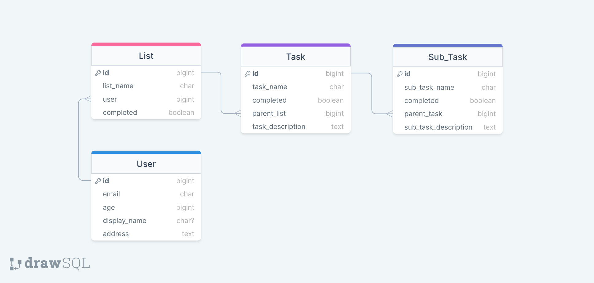

# User Authentication

In this assignment you will create a user and add user permissions to an already existing API.

## Assignment

Create an App_User for your To-Do-List API and create the endpoints to fulfill the follwoing requirements:

- `POST /api/users/signup/` status 201 success | 400 bad-request

> Receives all arguments in the `request.body` needed to successfully create a new user. Remember Email must be a unique identifier
> Responds with a newly generated user Auth Token

- `POST /api/users/login/` status 200 success | 404 none-exist | 400 bad-request

> Receives all credentials needed to `authenticate` a user
> Returns an already existing/newly created Auth Token

- `POST /api/users/logout/` status 204 success | 401 unauthorized

> Deletes a users authentication Token and returns an empty response

- `PUT /api/users/` status 200 success | 401 unauthorized | 400 bad-request

> Updates user age display_name and address if included in the requests body
> ONLY updates password if the `new_password` and `old_password` are included in the request and the `old_password` and current email authenticates to the current existing user.

## Adding Permissions

The following API endpoints should only be accessible to requests that provide a valid Authentication Token under the Authorization Header and should only respond with Lists/Tasks/SubTasks that belong to this user. If the Token is not valid or included in the request, we should recieve an 401 HTTP response.

- `/api/lists/`
- `/api/lists/<int:id>/`
- `/api/lists/<int:id>/tasks/`
- `/api/lists/<int:id>/tasks/<int:task_id>/`
- `/api/lists/<int:id>/tasks/<int:task_id>/subtasks/`
- `/api/lists/<int:id>/tasks/<int:task_id>/subtasks/<int:subtask_id>/`  
# Django-ToDoList
